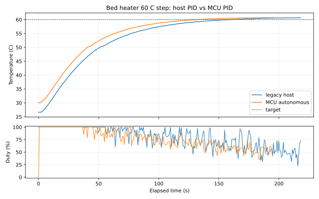
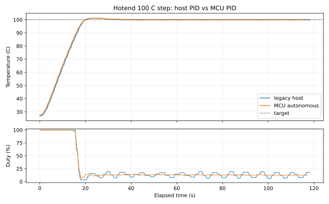

# Autonomous Heater Control: Physical Qualification and Rationale

**Atlas / Helix technical white paper — July 2026**

## Executive result

Helix moved heater PID execution from the Linux host to the MCU that owns the
ADC and heater output. The host still configures targets, gains, limits, and
policy; the MCU acquires temperature through the shared DMA ADC stream, runs a
fixed-period loop, enforces safety, and can continue bounded control through a
temporary host loss.

Four physical step tests on the V0 printer compared the original host loop
with the MCU loop. At a 100 C hotend target, the measured last-minute
temperature standard deviation fell from 0.1052 C to 0.00625 C (16.8x) and
duty standard deviation fell from 0.04263 to 0.00418 (10.2x). At a 60 C bed
target, temperature standard deviation fell from 0.2019 C to 0.1683 C and duty
standard deviation from 0.1544 to 0.0880. Overshoot was effectively unchanged
within the resolution of these runs.

These are direct results from one printer, sensor chain, load, and gain set.
They establish that local execution is at least competitive and materially
more repeatable on the hotend; they do not establish a universal performance
ratio for every heater.





## Why move the loop

The plant is slow, so raw CPU speed is not the argument. The architectural
difference is where timing uncertainty and failure boundaries enter:

```text
host PID
  ADC -> MCU filtering -> transport -> Linux scheduling -> PID
      -> transport -> MCU PWM scheduler -> heater

Helix MCU PID
  ADC -> DMA window -> fixed MCU loop -> local PWM -> heater
                    \-> bounded telemetry -> host
```

The local path removes transport latency and non-real-time host scheduling
from the feedback loop. It also makes the safety authority coherent: the MCU
that observes stale, invalid, or excessive temperature is the same MCU that
can force its output off. The host remains responsible for policy and
operator-facing orchestration, but is no longer a required participant in
every control update.

The measured MCU cadence supports that claim. The RP2040 bed loop ran at
300.000017 ms with 0.176 us standard deviation. The STM32G0B1 hotend loop ran
at 300.000539 ms with 2.796 us standard deviation and a recorded range of
299.982 through 300.049 ms. This is loop-repeatability evidence, not a claim
that a heater needs microsecond response.

## Test method

Each capture began with the heater idle, commanded one step, sampled the
public heater status at approximately 0.5 to 0.75 second intervals, and ended
after the temperature remained within 1 C of target for 60 seconds. The
qualification script always requested target zero on exit. The same physical
heater, thermistor, PWM cycle, configured PID gains, report cadence, and
analysis were used within each host/MCU pair.

The runs were sequential rather than randomized. Their initial temperatures
were not identical, particularly for the slow bed, so rise and band-entry
times are recorded but are not used to claim that one controller heats faster.
Steady-state statistics use the final 60 seconds. Duty statistics are sampled
telemetry rather than electrical pulse measurements.

The summary data are in
[heater_control_qualification.csv](data/heater_control_qualification.csv).
The complete raw captures are retained as:

- [legacy bed 60 C](evidence/heater_control/legacy-bed60.csv)
- [MCU bed 60 C](evidence/heater_control/mcu-bed60.csv)
- [legacy hotend 100 C](evidence/heater_control/legacy-hotend100.csv)
- [MCU hotend 100 C](evidence/heater_control/mcu-hotend100.csv)

The plots and metrics are reproducible with
`scripts/helix_heater_analyze.py`.

## Measured comparison

| Heater | Controller | Overshoot | Last-minute mean error | Temperature standard deviation | Peak-to-peak | Duty standard deviation |
| --- | --- | ---: | ---: | ---: | ---: | ---: |
| Bed, 60 C | Host | 0.70 C | +0.424 C | 0.2019 C | 0.69 C | 0.1544 |
| Bed, 60 C | MCU | 0.71 C | +0.512 C | 0.1683 C | 0.61 C | 0.0880 |
| Hotend, 100 C | Host | 1.17 C | -0.00025 C | 0.1052 C | 0.34 C | 0.0426 |
| Hotend, 100 C | MCU | 1.21 C | -0.00025 C | 0.00625 C | 0.04 C | 0.00418 |

The bed result is mixed: local execution reduced variation, while its positive
steady offset and RMSE were slightly higher. The hotend result is much
stronger: mean error and overshoot stayed comparable while both temperature
and actuator variation fell by roughly an order of magnitude. The honest
conclusion is improved repeatability, not universally better values for every
metric.

## Host-loss behavior

With the hotend holding 100 C, Klippy was stopped for eight seconds. Firmware
reported `active -> autonomous -> active`, maintained bounded temperature and
duty, accepted the returning liveness signal, and did not fault. This proves
continuity for that bounded interruption. Autonomous-duration expiry, sensor
open/short, ceiling, and ADC-deadline cutoffs remain separate destructive or
fault-injection gates and are not inferred from the continuity test.

## Autotune and gain scheduling

System identification remains a host responsibility because it is rare and
benefits from complete traces. During identification, however, the MCU still
owns the ADC validity, ceiling, sample-deadline, and maximum-output guards.

The original fixed full-power relay remains available as `METHOD=LEGACY`.
Helix also implements a power-balanced adaptive relay inspired by the
[Kalico PID calibration design](https://docs.kalico.gg/PID.html): it adjusts
relay power until oscillations are centered around the operating point and
recent power estimates converge. The resulting ultimate gain and period may
be converted using classic Ziegler-Nichols or the less aggressive
Tyreus-Luyben rule. A completed run is only a candidate; it cannot change live
behavior until explicitly validated.

Validated runs form bounded gain curves over target temperature. When a
context sensor is configured and the measurements span a non-degenerate area,
Helix may fit `gain = a + b*target + c*context`. Selection is allowed only
inside the measured convex hull and configured gain bounds. Everything else
falls back to the base profile. The host selects the profile and uploads one
gain set; the MCU never evaluates an unconstrained model in its control loop.

The existing guarded legacy autotune at 100 C completed and produced finite
coefficients (`Kp=41.191`, `Ki=3.923`, `Kd=108.128`) while returning the target
to zero. It predated the profile registry and therefore is not presented as a
stored or validated run. Physical adaptive autotune, candidate validation,
interpolation, and dynamic activation remain open qualification gates.

## Oversampling, noise, and the information ceiling

For independent quantization noise, averaging `N` samples can ideally gain
`0.5*log2(N)` bits. OSR128 therefore offers at most 3.5 additional bits: a
12-bit converter has a 15.5-bit ideal ceiling, even if its accumulator is
represented in 16 bits. Noise is the carrying mechanism only when it moves
samples across code boundaries and is sufficiently uncorrelated. Correlated
interference, reference drift, settling error, INL, and DNL do not disappear
through averaging.

This is why a quiet DC capture cannot establish ENOB. A stuck code may mean
excellent short-term stability or simply no information about the signal's
sub-code position. `scripts/analyze_adc_enob.py` reports DC code occupancy,
noise-limited bits, peak-to-peak/noise-free bits, and lag-one correlation; it
marks a stuck DC result unresolved. A driven low-distortion sine is required
for residual SINAD-equivalent ENOB, which includes noise and distortion.

The hardware path now permits retained accumulator bits with
`adc_stream_hardware_shift`. Its compatibility default shifts OSR128 by seven
back to native scale. Shift three represents 0..65520 and retains the 15.5-bit
ideal opportunity while consistently scaling temperature conversion, local
targets, and safety thresholds. It does not manufacture resolution.

Deliberate ADC dither is justified only if raw-code histograms show inadequate
natural threshold crossing and a controlled experiment improves sine-derived
ENOB. Heater-output dithering is a different question: existing PWM already
has far finer time resolution than the thermal plant needs, so it remains off
absent evidence that actuator quantization is limiting.

An external waveform is not required for the more practical end-to-end test.
`HELIX_HEATER_SINE_TEST` first stabilizes the installed heater, then applies a
slow biased PWM sine under an MCU-local temperature ceiling. The temperature
fit absorbs gain and phase; its residual measures harmonics, noise, drift,
airflow, sensor error, and ADC error together. Repeating periods produces a
thermal-chain frequency response and SINAD comparison against the ideal PWM
command. This is effective control resolution, not isolated ADC ENOB, because
the thermal plant is intentionally part of the experiment.

## Qualification still required

- Run adaptive autotune on both bed and hotend, archive the traces, and compare
  ZN/TL candidates for overshoot, settling, variance, and disturbance recovery.
- Validate multiple targets and prove exact, interpolated, context-surface,
  restart, fallback, convex-hull, and bumpless activation behavior physically.
- Capture ADC OSR 1 through 128 from the same DC and low-distortion sine fixture
  with retained bits; publish histograms, autocorrelation, SINAD, and ENOB.
- Run guarded PWM-sine tests at several periods and compare fitted thermal-
  chain gain, phase, SINAD, and residual spectra between controller modes.
- Exercise autonomous-duration, ADC-deadline, sensor-open/short, and ceiling
  cutoffs with independent temperature evidence.
- Repeat controller comparisons after representative fan, flow, chamber, and
  supply disturbances; a single undisturbed step is not the entire plant.

## Conclusion

The current evidence supports the architectural change. Local control reduced
the feedback path, survived a bounded host interruption, and improved physical
repeatability—dramatically on the hotend and modestly on the bed—without
worsening overshoot in these tests. The design remains conservative about what
has not yet been measured: candidates require validation, gain models cannot
extrapolate, safety stays local, and a 16-bit representation is never confused
with 16-bit analog information.
