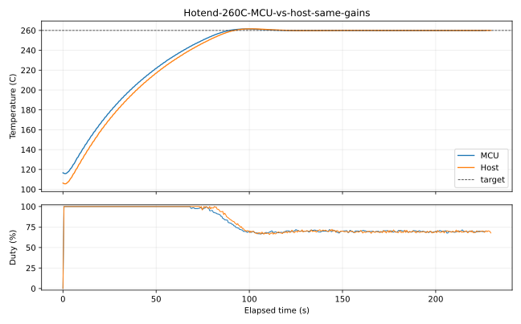

# Autonomous Heater Control: Physical Qualification and Rationale

**Atlas / Helix technical white paper — July 2026**

## Executive result

Helix moved heater PID execution from the Linux host to the MCU that owns the
ADC and heater output. The host still configures targets, gains, limits, and
policy; the MCU acquires temperature through the shared DMA ADC stream, runs a
fixed-period loop, enforces safety, and can continue bounded control through a
temporary host loss.

Four physical step tests on the V0 printer compared the original host loop
with the MCU loop. At a 100 C hotend target, the measured last-minute
temperature standard deviation fell from 0.1052 C to 0.00625 C (16.8x) and
duty standard deviation fell from 0.04263 to 0.00418 (10.2x). At a 60 C bed
target, temperature standard deviation fell from 0.2019 C to 0.1683 C and duty
standard deviation from 0.1544 to 0.0880. Overshoot was effectively unchanged
within the resolution of these runs.

These are direct results from one printer, sensor chain, load, and gain set.
They establish that local execution is at least competitive and materially
more repeatable on the hotend; they do not establish a universal performance
ratio for every heater.

Release qualification then moved the hotend operating point to 260 C. The
original zero-to-power adaptive relay failed its convergence gate at 200 C. A
new symmetric relay first measured the holding bias, then adapted independent
`B-Delta` and `B+Delta` outputs. At 260 C it converged in seven cycles to
`B=0.6984`, `Delta=0.0896`, `Ku=0.15485`, and `Tu=16.0004 s`. The validated
Tyreus-Luyben profile held the final 60 seconds with -0.0033 C mean error,
0.0223 C standard deviation, and 0.09 C peak-to-peak variation.

All future hotend qualification in this plan uses 260 C unless a test is
explicitly labeled as a lower-temperature developmental baseline. This keeps
identification and control evidence at the ABS operating point that matters.

An equal-gain host comparison at 260 C was intentionally less dramatic than
the earlier 100 C result: host and MCU standard deviations were 0.02225 C and
0.02233 C respectively. That is a tie at the installed measurement floor, not
a failure. It shows that the MCU's durable advantage is autonomous safety and
local ownership; better steady thermal variance is workload- and plant-
dependent and is not claimed universally.




## Why move the loop

The plant is slow, so raw CPU speed is not the argument. The architectural
difference is where timing uncertainty and failure boundaries enter:

```text
host PID
  ADC -> MCU filtering -> transport -> Linux scheduling -> PID
      -> transport -> MCU PWM scheduler -> heater

Helix MCU PID
  ADC -> DMA window -> fixed MCU loop -> local PWM -> heater
                    \-> bounded telemetry -> host
```

The local path removes transport latency and non-real-time host scheduling
from the feedback loop. It also makes the safety authority coherent: the MCU
that observes stale, invalid, or excessive temperature is the same MCU that
can force its output off. The host remains responsible for policy and
operator-facing orchestration, but is no longer a required participant in
every control update.

The measured MCU cadence supports that claim. The RP2040 bed loop ran at
300.000017 ms with 0.176 us standard deviation. The STM32G0B1 hotend loop ran
at 300.000539 ms with 2.796 us standard deviation and a recorded range of
299.982 through 300.049 ms. This is loop-repeatability evidence, not a claim
that a heater needs microsecond response.

The firmware's temperature field is a local tangent around the active target,
not a replacement for the nonlinear thermistor model. Helix marks it invalid
when idle or more than 5 C from target and returns `null` rather than displaying
a stale post-test value. Hard sensor-range and maximum-temperature decisions
continue to use exact precomputed ADC thresholds and do not depend on that
display estimate.

## Test method

Each capture began with the heater idle, commanded one step, sampled the
public heater status at approximately 0.5 to 0.75 second intervals, and ended
after the temperature remained within 1 C of target for 60 seconds. The
qualification script always requested target zero on exit. The same physical
heater, thermistor, PWM cycle, configured PID gains, report cadence, and
analysis were used within each host/MCU pair.

The runs were sequential rather than randomized. Their initial temperatures
were not identical, particularly for the slow bed, so rise and band-entry
times are recorded but are not used to claim that one controller heats faster.
Steady-state statistics use the final 60 seconds. Duty statistics are sampled
telemetry rather than electrical pulse measurements.

The summary data are in
[heater_control_qualification.csv](data/heater_control_qualification.csv).
The complete raw captures are retained as:

- [legacy bed 60 C](evidence/heater_control/legacy-bed60.csv)
- [MCU bed 60 C](evidence/heater_control/mcu-bed60.csv)
- [legacy hotend 100 C](evidence/heater_control/legacy-hotend100.csv)
- [MCU hotend 100 C](evidence/heater_control/mcu-hotend100.csv)
- [MCU hotend 260 C, symmetric profile](evidence/heater_control/mcu-hotend260-symmetric-hold.csv)
- [MCU hotend 260 C metrics](evidence/heater_control/mcu-hotend260-symmetric-hold.json)
- [MCU hotend 260 C plot](img/heater-control-hotend260-symmetric-hold.svg)
- [host hotend 260 C, identical gains](evidence/heater_control/host-hotend260-symmetric-gains-hold.csv)
- [260 C comparison metrics](evidence/heater_control/hotend260-mcu-vs-host.json)
- [260 C symmetric tune record](evidence/heater_control/hotend260-symmetric-tune.json)

The plots and metrics are reproducible with
`scripts/helix_heater_analyze.py`.

## Measured comparison

| Heater | Controller | Overshoot | Last-minute mean error | Temperature standard deviation | Peak-to-peak | Duty standard deviation |
| --- | --- | ---: | ---: | ---: | ---: | ---: |
| Bed, 60 C | Host | 0.70 C | +0.424 C | 0.2019 C | 0.69 C | 0.1544 |
| Bed, 60 C | MCU | 0.71 C | +0.512 C | 0.1683 C | 0.61 C | 0.0880 |
| Hotend, 100 C | Host | 1.17 C | -0.00025 C | 0.1052 C | 0.34 C | 0.0426 |
| Hotend, 100 C | MCU | 1.21 C | -0.00025 C | 0.00625 C | 0.04 C | 0.00418 |
| Hotend, 260 C | Host, same gains | 1.66 C | -0.00092 C | 0.02225 C | 0.11 C | 0.00852 |
| Hotend, 260 C | MCU | 1.53 C | -0.00325 C | 0.02233 C | 0.09 C | 0.00691 |

The bed result is mixed: local execution reduced variation, while its positive
steady offset and RMSE were slightly higher. The hotend result is much
stronger: mean error and overshoot stayed comparable while both temperature
and actuator variation fell by roughly an order of magnitude. The honest
conclusion is improved repeatability, not universally better values for every
metric.

At 260 C the two controllers are thermally indistinguishable in steady state.
The MCU used slightly less actuator variation and peak-to-peak temperature,
but those differences are too small for a broad superiority claim. The loop-
timing fields from these captures are not compared: MCU counters accumulated
startup and manual-test phases, while host counters began at the qualification
mode switch.

## Host-loss behavior

With the hotend holding 100 C, Klippy was stopped for eight seconds. Firmware
reported `active -> autonomous -> active`, maintained bounded temperature and
duty, accepted the returning liveness signal, and did not fault. This proves
continuity for that bounded interruption. Autonomous-duration expiry, sensor
open/short, ceiling, and ADC-deadline cutoffs remain separate destructive or
fault-injection gates and are not inferred from the continuity test.

## Autotune and gain scheduling

System identification remains a host responsibility because it is rare and
benefits from complete traces. During identification, however, the MCU still
owns the ADC validity, ceiling, sample-deadline, and maximum-output guards.

The original fixed full-power relay remains available as `METHOD=LEGACY`.
Helix also retains a zero-to-power adaptive relay inspired by the
[Kalico PID calibration design](https://docs.kalico.gg/PID.html): it adjusts
relay power until oscillations are centered around the operating point and
recent power estimates converge. The resulting ultimate gain and period may
be converted using classic Ziegler-Nichols or the less aggressive
Tyreus-Luyben rule. A completed run is only a candidate; it cannot change live
behavior until explicitly validated.

That one-sided method converged at 100 C and 120 C, but failed honestly at
200 C: after the complete 60-peak budget, recent high-side estimates still
spanned 0.064 duty against a 0.02 limit. High-temperature loss put the relay
near the upper rail, coupling its bias and excitation amplitude.

`METHOD=SYMMETRIC` fixes that coupling. The ordinary controller first holds
the requested target and averages its duty. The relay then alternates around
that bias. Heating/cooling duration asymmetry and midpoint error update `B`;
measured oscillation amplitude updates `Delta`. Convergence requires stable
recent bias and amplitude estimates, centered extrema, balanced half cycles,
and rail margin. Ultimate gain uses the actual symmetric relay amplitude,
`Ku = 4*Delta/(pi*a)`. After physical qualification at 260 C, this is the
default method for `helix_pid`; `METHOD=ADAPTIVE` remains available for
controlled reproduction of the older algorithm.

Validated runs form bounded gain curves over target temperature. When a
context sensor is configured and the measurements span a non-degenerate area,
Helix may fit `gain = a + b*target + c*context`. Selection is allowed only
inside the measured convex hull and configured gain bounds. Everything else
falls back to the base profile. The host selects the profile and uploads one
gain set; the MCU never evaluates an unconstrained model in its control loop.

Validated physical points now exist at 60 C for the bed and 100, 120, and
260 C for the hotend. Candidate inactivity, explicit validation, restart
persistence, exact selection, 100-to-120 C interpolation, no-extrapolation
fallback, and applied-gain clamp visibility were exercised. The 260 C run
`56f9ef65923838a5` produced raw TL gains `17.948/0.510/45.583`; the configured
0.25x base floor bounded Ki to 2.03725, and both raw and applied values were
reported before the hold test. Context-surface fitting and a held, bumpless
profile transition remain separate gates.

## Oversampling, noise, and the information ceiling

For independent quantization noise, averaging `N` samples can ideally gain
`0.5*log2(N)` bits. OSR128 therefore offers at most 3.5 additional bits: a
12-bit converter has a 15.5-bit ideal ceiling, even if its accumulator is
represented in 16 bits. Noise is the carrying mechanism only when it moves
samples across code boundaries and is sufficiently uncorrelated. Correlated
interference, reference drift, settling error, INL, and DNL do not disappear
through averaging.

This is why a quiet DC capture cannot establish ENOB. A stuck code may mean
excellent short-term stability or simply no information about the signal's
sub-code position. `scripts/analyze_adc_enob.py` reports DC code occupancy,
noise-limited bits, peak-to-peak/noise-free bits, and lag-one correlation; it
marks a stuck DC result unresolved. A driven low-distortion sine is required
for residual SINAD-equivalent ENOB, which includes noise and distortion.

The hardware path now permits retained accumulator bits with
`adc_stream_hardware_shift`. Its compatibility default shifts OSR128 by seven
back to native scale. Shift three represents 0..65520 and retains the 15.5-bit
ideal opportunity while consistently scaling temperature conversion, local
targets, and safety thresholds. It does not manufacture resolution.

Deliberate ADC dither is justified only if raw-code histograms show inadequate
natural threshold crossing and a controlled experiment improves sine-derived
ENOB. Heater-output dithering is a different question: existing PWM already
has far finer time resolution than the thermal plant needs, so it remains off
absent evidence that actuator quantization is limiting.

An external waveform is not required for the more practical end-to-end test.
`HELIX_HEATER_SINE_TEST` first stabilizes the installed heater, then applies a
slow biased PWM sine under an MCU-local temperature ceiling. The temperature
fit absorbs gain and phase; its residual measures harmonics, noise, drift,
airflow, sensor error, and ADC error together. Repeating periods produces a
thermal-chain frequency response and SINAD comparison against the ideal PWM
command. This is effective control resolution, not isolated ADC ENOB, because
the thermal plant is intentionally part of the experiment.

The first 260 C attempt exposed a transient-bias defect: `BIAS=AUTO` sampled
one PWM value immediately after setpoint entry and the open-loop hotend drifted
to 272.6 C. The run was rejected and Klippy was stopped before the independent
280 C guard. AUTO bias now averages a closed-loop settling window, explicit
bias retains the same settling phase, the controller terminates itself at the
manual ceiling, and target-clear is an abort condition. The corrected 30 s
run measured bias 0.69297; the matched 60 s run used that value and independently
remeasured 0.69101, only 0.00196 duty apart.

A console command submitted through the same synchronous G-code request may
wait behind this intentionally blocking experiment. Qualification therefore
uses an out-of-band emergency-stop path or the physical stop, in addition to
the independent MCU ceiling; it does not rely on a queued console `M112`.

| 260 C excitation | Gain | Phase | Drift | Residual RMS | Thermal-chain SINAD |
| --- | ---: | ---: | ---: | ---: | ---: |
| 30 s, +/-0.03 duty | 12.156 C/duty | -111.75 deg | +0.211 C/min | 0.0365 C | 16.98 dB |
| 60 s, +/-0.03 duty | 28.843 C/duty | -93.49 deg | +0.420 C/min | 0.0666 C | 19.27 dB |

The 60 s response has 2.37x the gain of the 30 s response, directly showing
the installed hotend's low-pass thermal behavior. Raw captures and plots are
[30 s data](evidence/heater_control/mcu-hotend260-sine-p30.csv),
[60 s data](evidence/heater_control/mcu-hotend260-sine-p60.csv),
[30 s plot](img/heater-control-sine-260c-p30.svg), and
[60 s plot](img/heater-control-sine-260c-p60.svg).
These fits and dependency-free SVGs are reproducible with
`scripts/analyze_thermal_sine.py`.

The 100 C and 200 C captures and plots are retained as development history,
not acceptance evidence. They exposed the hardware-shift and high-temperature
one-sided-relay problems that led to the qualified 260 C method.

- 100 C: [initial shift-7 data](evidence/heater_control/mcu-hotend100-sine-p30-shift7.csv),
  [corrected 30 s data](evidence/heater_control/mcu-hotend100-sine-p30.csv),
  [corrected 60 s data](evidence/heater_control/mcu-hotend100-sine-p60.csv),
  [shift-7 plot](img/heater-control-sine-p30-shift7.svg),
  [30 s plot](img/heater-control-sine-p30.svg), and
  [60 s plot](img/heater-control-sine-p60.svg)
- 200 C: [30 s data](evidence/heater_control/mcu-hotend200-sine-p30.csv),
  [60 s data](evidence/heater_control/mcu-hotend200-sine-p60.csv),
  [30 s plot](img/heater-control-sine-200c-p30.svg), and
  [60 s plot](img/heater-control-sine-200c-p60.svg)

## Qualification still required

- Complete physical context-surface, convex-hull, and held bumpless-transition
  qualification; exact/interpolated/restart/fallback behavior is complete.
- Capture ADC OSR 1 through 128 from the same DC and low-distortion sine fixture
  with retained bits; publish histograms, autocorrelation, SINAD, and ENOB.
- Extend the completed 260 C two-period response with representative fan,
  extrusion-flow, chamber, and supply disturbances.
- Exercise autonomous-duration, ADC-deadline, sensor-open/short, and ceiling
  cutoffs with independent temperature evidence.
- Repeat controller comparisons after representative fan, flow, chamber, and
  supply disturbances; a single undisturbed step is not the entire plant.

## Conclusion

The current evidence supports the architectural change without requiring a
universal thermal-variance claim. Local control reduced the feedback path,
survived a bounded host interruption, and at 260 C matched host control with
the same gains while removing host availability from the safety boundary. The
symmetric tuner solved a measured high-loss failure of the one-sided method.
The design remains conservative about what has not yet been measured: context
models require validation, gain models cannot extrapolate, destructive cutoffs
remain open gates, and a 16-bit representation is never confused with 16-bit
analog information.
