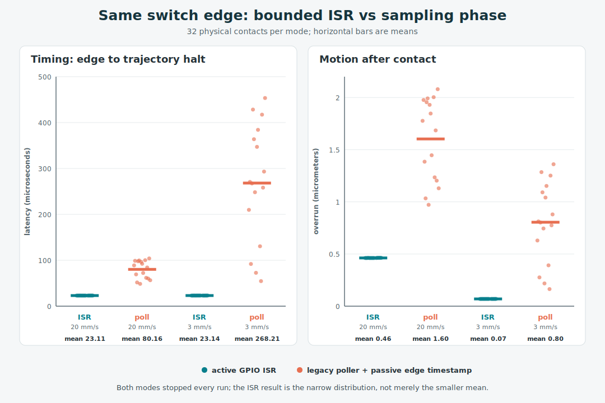

# Why interrupt-driven endstops? A direct comparison

Status: physical measurement and explanatory note, 2026-07-15.

## The short answer

The main result is **repeatability**, not whether a few micrometers of overrun
matter mechanically. The interrupt path stopped the trajectory about
**23.1 us** after every observed edge. Its standard deviation was only 0.042 us
on the fast pass and 0.050 us on the slow pass—approximately the resolution of
the 12 MHz measurement clock.

Polling also worked correctly: all 32 contacts completed without a shutdown,
missed trigger, or scheduler fault. But its response depended on sampling
phase. Standard deviation grew to **19.7 us** at 20 mm/s and **129.0 us** at
3 mm/s, with full ranges of 48.6--104.0 us and 54.6--453.5 us respectively.



The honest conclusion is not "polling is broken." It is that the ISR converts
a phase-dependent detector into a consistent one. That consistency is useful
even where the absolute distance is mechanically insignificant: it removes a
source of run-to-run uncertainty and provides a trustworthy event timestamp.
This experiment measures detector response, not final nozzle-position
repeatability, and it did not force the scheduler into overload.

## What is different?

A physical switch does not change state exactly when a software timer happens
to inspect it.

```text
Legacy polling

switch edge       next scheduled read    three confirmation reads     stop
     |---------- variable wait ----------|---- 15 us ---- 15 us ---- 15 us -->

Hardware interrupt

switch edge       GPIO IRQ      four 5 us qualification reads         stop
     |-------------|---------------------- fixed work --------------------->
```

Both paths ultimately call the same `trsync` coordinated-stop fan-out and halt
the same trajectory backend. Only the detection step changes.

The legacy implementation in [`src/endstop.c`](../src/endstop.c) schedules a
pin read on the MCU timer list. Once a matching sample is found, it requires
four matching reads in total. The first wait depends on where the switch edge
lands in the poll cycle.

The HELIX implementation in
[`src/trigger_source.c`](../src/trigger_source.c) lets the GPIO peripheral
interrupt the MCU. The RP2040 timestamps entry to the GPIO interrupt, performs
a fixed 20 us qualification burst, and fires `trsync`. Boards with a routed
timer-capture input can timestamp the electrical edge even more precisely.

### Why did slower polling have more timing variation?

Klipper does not use a fixed endstop polling rate. Its host computes
`rest_time` from the duration of the homing move and the maximum number of
steps taken by any stepper attached to the endstop:

```text
poll interval = move time / step count
              = step distance / homing speed
```

This Z axis has 800 configured microsteps/mm, so one microstep is 1.25 um. The
resulting polling intervals were therefore:

```text
20 mm/s: 1.25 um / 20 mm/s =  62.5 us
 3 mm/s: 1.25 um /  3 mm/s = 416.7 us
```

The electrical edge can occur anywhere inside that interval. For a uniformly
distributed sampling phase, the expected standard deviation is the interval
divided by the square root of 12. That simple model predicts 18.0 us timing SD
fast and 120.3 us slow, close to the measured 19.7 and 129.0 us:

| Pass | Poll interval | Phase-model timing SD | Measured timing SD | Distance per poll | Travel during 45 us confirmation |
| --- | ---: | ---: | ---: | ---: | ---: |
| 20 mm/s | 62.5 us | 18.0 us | 19.7 us | 1.25 um | 0.900 um |
| 3 mm/s | 416.7 us | 120.3 us | 129.0 us | 1.25 um | 0.135 um |

This explains the initially counter-intuitive result: slower homing produces a
larger deviation in *time* because Klipper also slows the detector. It does not
produce a proportionally larger deviation in *distance*. Multiplying the poll
interval by speed always returns one microstep, so the sampling-phase portion
of spatial uncertainty remains about 1.25 um at either speed. The slower pass
also travels less during the fixed confirmation window.

Slowing down is therefore still useful. It reduces kinetic energy, switch and
frame impact, mechanical deflection, and confirmation-window travel. What it
does **not** improve under proportional polling is detector timing consistency
or the roughly one-microstep spatial sampling quantum. If the purpose of the
slow second pass includes more consistent detection—not only gentler
mechanics—then scaling the poll interval entirely with step time works against
that purpose.

A more consistent software fallback on capable MCUs would cap the interval:

```text
poll interval = min(step interval, fixed maximum interval)
```

That would preserve Klipper's step-scaled timer load at higher speeds while
preventing slow motion from degrading into 400+ us sampling intervals. The
tradeoff is increased timer traffic on small or already saturated MCUs, which
is a plausible reason for the conservative proportional policy. Hardware
interrupts avoid the compromise: their response does not scale with motion
speed.

## A direct A/B experiment

The earlier test could timestamp the interrupt edge but not the polling edge,
so its polling result was an architecture-derived range. This experiment adds
a passive shadow observer for commissioning:

```ini
[mcu]
hardware_endstop_trigger: False
hardware_endstop_observer: True
```

In that mode the GPIO ISR records the first edge and immediately returns. It
does **not** qualify the edge, fire `trsync`, or stop motion. The original
polling timer remains the sole stop owner. The flight recorder then contains
both the observer edge clock and the actual trajectory halt clock. Normal ISR
mode records the same two clocks with the interrupt as stop owner.

The passive timestamp uses the non-stopping `edge_observed` execution-record
type. It is deliberately distinct from `trigger`, so failure recovery and
Atlas do not mistake a measurement for a trajectory truncation or incident.

This makes the comparison direct:

```text
response time = trajectory halt clock - observed edge clock
physical overrun = homing speed x response time
```

The passive observer necessarily adds a small GPIO-ISR and log-write cost to
the polling run. It skips the active path's 20 us busy-wait specifically to
minimize that disturbance. The remaining observer overhead biases the result
slightly against polling; a logic-analyzer capture of the switch and step pins
would remove it completely.

### Test system

- Voron V0 Z microswitch on SKR Pico GPIO25;
- RP2040 firmware `52e5c7f0-dirty-20260715_094507-linuxathena`;
- 12 MHz scheduler timebase;
- HELIX trajectory motion on Z;
- 20 mm/s first contact and 3 mm/s second contact;
- 32 microsteps, 8 mm rotation distance, 200 full steps per rotation:
  800 configured microsteps/mm, or 1.25 um/microstep;
- four 15 us confirmation samples for polling;
- four 5 us qualification reads for the active ISR path.

The balanced order was ISR(8 homes), poll(8), poll(8), ISR(8). Every home has
a fast and slow contact, yielding 32 contacts per mode and 16 observations per
speed per mode. A temporary fixture removed an unrelated Z hop and released
the switch to Z10 between homes. The exact pre-test configuration was restored
on disk after the series. No heater command was issued by the test.

After the measurement implementation was committed, the exact `02426d43`
firmware image was flashed for final sign-off. One additional polling-observer
home emitted type 9 `edge_observed` records and stopped after 73.17 us fast and
91.58 us slow; Atlas stored both as informational observations rather than
stops or incidents. After restoring production ISR mode, one additional home
stopped after 23.17 us fast and 23.08 us slow. These four confirmation contacts
are not included in the 64-row statistical dataset. Klipper ended ready and
the production configuration matched its pre-test snapshot byte-for-byte.

## Results: timing and physical overrun

| Pass | Stop owner | Contacts | Edge-to-stop mean | Timing SD | Minimum--maximum | Mean motion after edge | Maximum motion after edge |
| --- | --- | ---: | ---: | ---: | ---: | ---: | ---: |
| 20 mm/s | GPIO ISR | 16 | 23.115 us | 0.042 us | 23.083--23.167 us | 0.462 um / 0.370 step | 0.463 um / 0.371 step |
| 20 mm/s | polling | 16 | 80.156 us | 19.662 us | 48.583--104.000 us | 1.603 um / 1.283 steps | 2.080 um / 1.664 steps |
| 3 mm/s | GPIO ISR | 16 | 23.141 us | 0.050 us | 23.083--23.250 us | 0.069 um / 0.056 step | 0.070 um / 0.056 step |
| 3 mm/s | polling | 16 | 268.214 us | 128.954 us | 54.583--453.500 us | 0.805 um / 0.644 step | 1.361 um / 1.088 steps |

The distribution is the finding. Across both speeds, ISR response occupied a
0.17 us band—two 12 MHz clock ticks. Polling varied across 55.4 us on the fast
pass and 398.9 us on the slow pass. At 20 mm/s, polling timing SD was about
472 times the ISR value; at 3 mm/s it was over 2,500 times the ISR value. Those
large ratios partly reflect the measurement clock becoming the ISR noise
floor, but they make the architectural difference unambiguous.

The absolute scale provides context, not the conclusion. Polling's worst result
was 2.08 um. That is measurable and larger than the ISR result, but it is not
evidence of a catastrophic homing overrun. Switch mechanics, frame compliance,
and motor holding behavior may dominate final homing-position repeatability.

## Did polling overrun the scheduler or shut the printer down?

No—not in this series.

"Overrun" can mean two different things:

1. **Physical overrun:** distance traveled after the switch edge. That is what
   the table and graph measure directly.
2. **Scheduler overrun:** firmware cannot service a timer before its deadline,
   leading to a `Timer too close`, shutdown, or related real-time fault. None
   occurred in these 32 polling contacts.

This distinction matters when interpreting past experience. A printer that
sometimes shuts down while homing may have an overloaded timer schedule, a
driver communication fault, a trajectory deadline problem, electrical noise,
or another failure that merely happens during homing. The baseline data here
cannot identify that historical cause.

The architectural case for interrupts under load remains plausible: on the
RP2040 the GPIO interrupt has higher priority than the scheduler interrupt, so
an edge is not forced to wait for the next endstop timer slot. But proving the
shutdown-resistance claim requires a separate controlled-load experiment that
increases repeatable MCU timer work until one path reaches its deadline limit.
It should not be inferred from this no-fault baseline.

## What the data supports

The direct evidence supports four narrower claims:

1. **Interrupt response is repeatable.** The active path stayed within
   23.083--23.250 us across both homing speeds.
2. **Polling response is phase-dependent.** Its broad distributions match the
   expected wait for a scheduled sample, especially at the slow step rate.
3. **Polling is a valid fallback.** It completed every baseline run and its
   absolute physical overrun was small.
4. **Interrupts improve observability.** They retain an edge-related clock that can
   be reconciled with the executed trajectory instead of reconstructing a
   trigger time from a later sample.

That is sufficient reason to use hardware events by default where supported,
while retaining polling for portability. It is not sufficient reason to claim
that interrupts alone prevent every homing shutdown.

## Reproducing the graph

The 64 direct edge/stop records are retained in
[`data/interrupt_polling_direct.csv`](data/interrupt_polling_direct.csv). The
graph uses no plotting dependency:

```shell
python3 scripts/plot_interrupt_polling.py
```

The script derives microseconds from the 12 MHz clock and micrometers from the
constant contact speed. Raw edge clocks, halt clocks, sequence numbers, block
order, and tick deltas remain in the CSV so the aggregates can be independently
checked.
