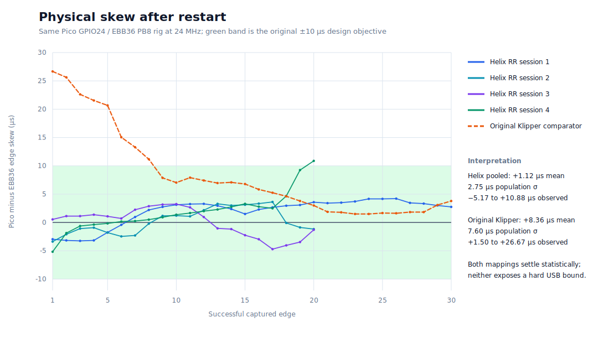
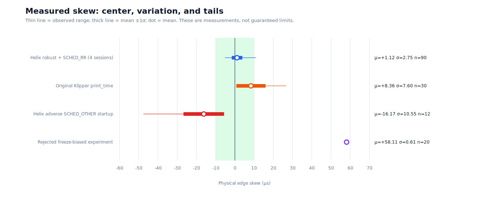
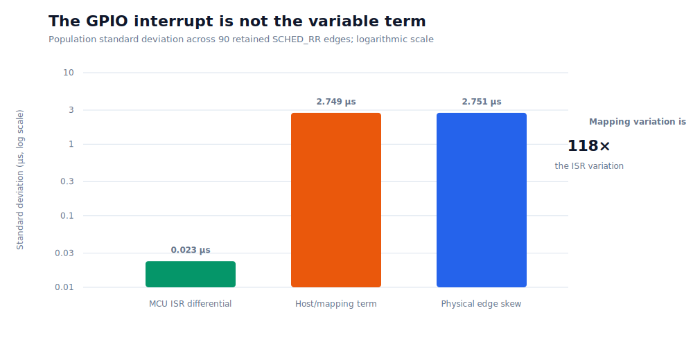
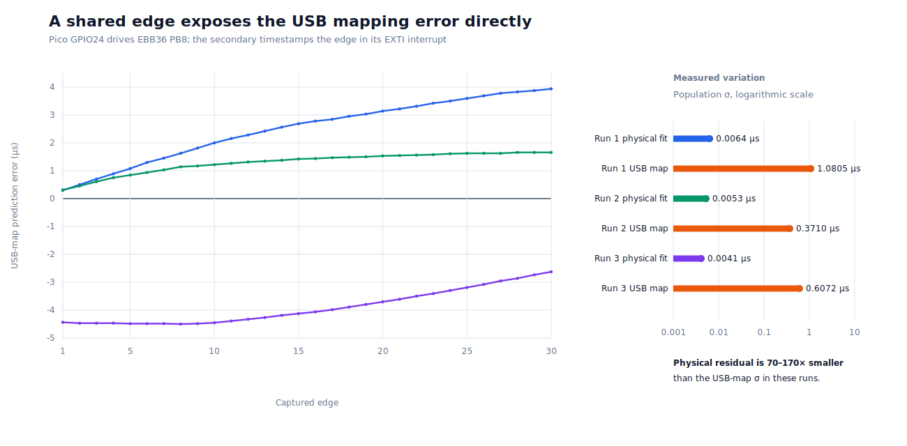
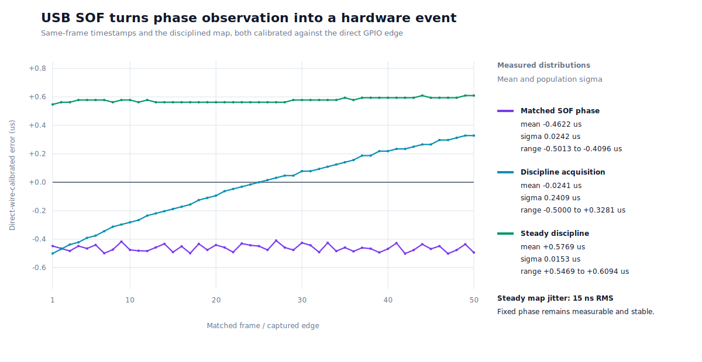
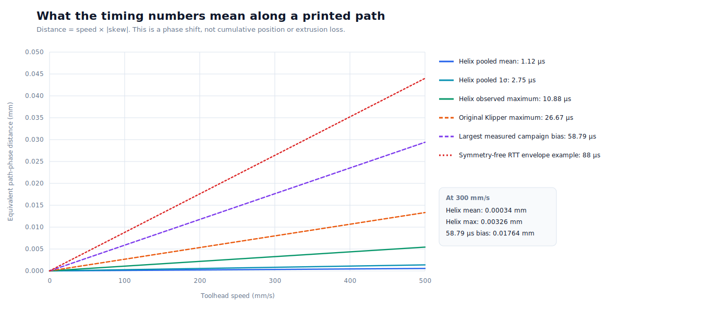

# Shared Machine Time Across Independent Printer MCUs

## A measured comparison of Helix and original Klipper scheduling

**Atlas / Helix technical white paper — July 2026**

## Abstract

A modern printer may place XY motion on one microcontroller and extrusion on
another. The two boards have independent oscillators and, when connected by
USB, independent and variably delayed communication paths. They must still
agree on *when* a motion event happens.

This paper measures that agreement on a working Voron V0 using an RP2040 Pico
for motion and an STM32G0B1 EBB36 for extrusion. A 24 MHz logic analyzer
captured simultaneous GPIO events from both boards. The same physical rig was
then driven through two clock models:

1. Helix machine time, in which the primary MCU clock is the shared timeline
   and the secondary maintains a local affine mapping to it; and
2. original Klipper-style per-MCU `print_time` scheduling, in which the host
   maintains each MCU clock mapping and independently converts the same print
   time for each board.

Across four retained Helix sessions (90 edges), physical Pico-minus-EBB36 skew
had a mean of **+1.12 us**, population standard deviation of **2.75 us**, and
an observed range of **-5.17 to +10.88 us**. The original Klipper comparator
(30 edges) had a mean of **+8.36 us**, standard deviation of **7.60 us**, and
an observed range of **+1.50 to +26.67 us**. The comparison is a result for
this machine, topology, scheduler configuration, and test campaign—not a
universal bound for either architecture.

At 300 mm/s, the largest retained Helix observation corresponds to 0.00326 mm
of path phase. For the actual topology, where the EBB36 controls extrusion,
the same timing offset changes *where along the path* a flow transition lands;
it does not change total commanded extrusion. At 40 mm^3/s, 10.88 us spans
0.000435 mm^3, or roughly 0.00018 mm of 1.75 mm filament.

The data supports statistical qualification of this USB configuration. It
does not support treating the earlier +/-10 us objective as a hard universal
printer gate, because independent software-timestamped USB links cannot prove
a tight one-way delay bound without an assumption about path symmetry. A
timer-capture sync signal remains available when an application genuinely
requires hardware-bounded phase.

Three follow-up experiments sharpen that conclusion. Repeating the analyzer
test on a `PREEMPT_RT` kernel changed individual session distributions but did
not remove restart-dependent phase acquisition. A direct GPIO24-to-PB8 sync
wire then reduced physical clock-pairing residuals to **0.0041–0.0064 us
RMS**, while the simultaneously measured software-derived USB-map error was
**0.37–1.08 us RMS**. Finally, matching the hardware timestamp of the same USB
Start-of-Frame on both MCUs produced **0.024 us RMS** phase variation, and
using those pairs for discipline reduced the steady mapped-clock variation to
**0.015 us RMS** around a stable **+0.58 us** phase. The boards and interrupt
timestamps are exceptionally repeatable; software observation of USB, rather
than USB frame delivery itself, was the dominant limitation on this topology.

## 1. The problem in printer terms

Suppose the primary MCU begins an XY acceleration at machine time `T`, while
the toolhead MCU begins the corresponding extrusion change at `T + dt`. The
printer has not lost an extrusion command and neither motor is necessarily in
the wrong final position. Instead, one actuator's action is shifted along the
printed path by approximately:

```
path_phase = toolhead_velocity * dt
```

That distinction matters. A time error is not automatically a position error,
and a constant phase offset is not cumulative drift. The consequence depends
on which actuators are split across boards:

- With XY on the Pico and extrusion on the EBB36, the principal consequence
  is extrusion phase relative to the path.
- If coupled CoreXY motors were divided across MCUs, the same phase difference
  could become a direct kinematic vector error.
- For a fan, display, or ordinary status output, tens of microseconds are
  generally immaterial.
- For metrology or a synchronized camera trigger, a hardware-derived bound may
  be mandatory even if the printer itself operates correctly.

Qualification must therefore begin with the actuator topology and a physical
tolerance, not with an isolated microsecond threshold.

## 2. Two architectures, one observability problem

Original Klipper and Helix assign clock-model ownership differently, but both
must learn relationships between independent clocks from messages whose USB
delay varies.

| Property | Original Klipper scheduling | Helix machine time |
| --- | --- | --- |
| Timeline presented by host | Host `print_time` | Primary MCU machine clock |
| Clock model owner | Host maintains one model per MCU | Secondary maintains machine-to-local affine model |
| Command conversion | Host converts `print_time` separately for every MCU | Host sends machine time; secondary converts locally |
| Motion representation | Traditionally compressed step events | Scheduled motion intentions / trajectories |
| During a brief host delay | Queued events continue; future scheduling depends on host models | Queued intentions continue; secondary mapping is locally available |
| Recovery ownership | Primarily host-coordinated | Explicit MCU epoch, rebase, and convergence state |
| Fundamental USB observation | Round-trip software timestamps | Relayed beacons and round-trip software timestamps |

Moving the clock model to the MCU is useful: it aligns timing ownership with
onboard trajectory execution, allows local conversion of future intentions,
and makes rebase and convergence explicit protocol state. It does **not** make
the USB cable reveal its unknown one-way delay. That is a measurement problem,
not a solver-placement problem.

The useful comparison is consequently not “which one has a perfect clock?”
Neither does. It is:

- what distribution does each implementation produce on the same hardware;
- how does that distribution behave after restart and under load; and
- what do the observed values mean for the actual print process?

## 3. Experiment

### 3.1 Hardware and host

- Printer: Voron V0 test platform
- Primary motion MCU: RP2040 Pico
- Secondary/toolhead MCU: STM32G0B1 EBB36
- Primary timing output: Pico GPIO24
- Secondary timing output: EBB36 PB8
- Analyzer: FX2LA-compatible eight-channel logic analyzer
- Analyzer sample rate: 24 MHz, or 41.67 ns per sample
- Host kernel: `PREEMPT_DYNAMIC`
- Klipper process policy for retained comparison: `SCHED_RR`, priority 20

Each test requested the same future event time for both outputs. The logic
analyzer measured physical edge separation. Firmware also returned the
scheduled and actual GPIO clocks, which lets the result be decomposed as:

```
physical edge skew = clock-mapping skew + ISR/GPIO-dispatch skew
```

The sign convention throughout is Pico edge time minus EBB36 edge time.

### 3.2 Helix path

`SET_PIN_MACHINE_TIME` scheduled each edge in primary machine time. The Pico
used that clock directly. The EBB36 converted it through its disciplined
machine-to-local affine mapping. Four independent retained sessions produced
90 successful captured edges.

### 3.3 Original Klipper comparator

`SET_PIN_LEGACY_TIMING` scheduled the same physical pins by passing one host
`print_time` through each MCU's original Klipper clock conversion and normal
`set_digital()` command path. This is an apples-to-apples comparison of the
original per-MCU scheduling mechanism on the same boards, links, GPIOs,
analyzer, host scheduler, and capture tooling. It is not a claim that every
printer running upstream Klipper will reproduce this numerical distribution.

The comparator collected 30 successful edges after a five-second settle. Its
exact values and metadata are preserved in
[`klipper_legacy_r1_summary.json`](evidence/machine_time/klipper_legacy_r1_summary.json).
All plotted samples, including the Helix sessions and adverse controls, are in
[`scope_comparison_edges.csv`](evidence/machine_time/scope_comparison_edges.csv).

### 3.4 Realtime-kernel follow-up

The same analyzer procedure was repeated after booting Ubuntu
`6.8.1-1015-realtime` with `CONFIG_PREEMPT_RT=y`; Klipper remained
`SCHED_RR` priority 20. Two Helix sessions and one original-Klipper comparator
session were retained. This changes only the host scheduling environment. The
USB controllers, boards, pins, firmware timing instrumentation, and 24 MHz
analyzer remained the same.

### 3.5 Direct sync-line experiment

After the analyzer capture, Pico GPIO24 was connected directly to EBB36 PB8.
GPIO24 was the sole output. PB8 was configured as a passive rising-edge EXTI
input and could not fire `trsync` or stop motion. For every sample:

1. the EBB36 observer was armed;
2. the Pico scheduled one rising edge and reported its actual local clock;
3. the EBB36 latched its local clock at ISR entry; and
4. the host compared the captured tick with the firmware's current
   machine-to-local USB map.

PB8 is not routed to a TIM2 input-capture channel on this MCU implementation,
so this is an ISR-entry timestamp rather than timer input capture. That makes
the result conservative with respect to a future dedicated capture pin. An
affine fit between the two raw clock streams removes constant propagation,
phase, and oscillator-rate offset. Its residual measures physical pairing
repeatability independently of the USB mapping.

## 4. Results

### 4.1 Restart and convergence behavior



The original Klipper comparator began at +26.67 us and converged toward roughly
+1.5 to +3.8 us by the end of this capture. Helix also shows session-dependent
acquisition transients, followed by low-single-digit-microsecond regions. The
shape is important: a single measurement immediately after connection is not
a fair characterization of either clock estimator.

The green +/-10 us region is shown because it was the original Helix design
objective. It is a reference line, not a newly discovered physical cliff. The
printer does not abruptly change behavior at 9.99 versus 10.01 us.

### 4.2 Center, repeatability, and observed tails



| Dataset | Edges | Mean (us) | Population sigma (us) | Observed range (us) |
| --- | ---: | ---: | ---: | ---: |
| Helix retained, four SCHED_RR sessions | 90 | +1.12 | 2.75 | -5.17 to +10.88 |
| Original Klipper `print_time` comparator | 30 | +8.36 | 7.60 | +1.50 to +26.67 |
| Helix adverse SCHED_OTHER startup | 12 | -16.17 | 10.55 | -47.50 to -9.54 |
| Rejected phase-frozen acquisition experiment | 20 | +58.11 | 0.61 | +57.08 to +58.79 |

On this rig, the retained Helix configuration had both a smaller absolute mean
and a smaller spread than the original Klipper comparator. The sample counts
are enough to expose behavior and compare these runs, but not enough to claim
distribution-free worst-case bounds.

The two controls explain why mean, repeatability, and tails must be reported
together:

- Removing real-time host scheduling produced a larger and less repeatable
  startup error. Host scheduling policy affects the software-timestamped
  observation, even though the MCUs themselves are real-time devices.
- A phase-frozen experiment was exceptionally repeatable—only 0.61 us sigma—
  around a bad +58 us acquisition. Low variance alone does not imply accurate
  phase. That experiment was rejected and is not the shipped estimator.

### 4.3 Where the variation originates



Across the 90 retained Helix edges, the Pico-minus-EBB36 ISR/GPIO-dispatch
difference was approximately -1.77 us with only 0.023 us standard deviation.
The clock-mapping term varied by roughly 2.75 us—about two orders of magnitude
more. The physical measurement follows that mapping variation.

This rules out a tempting but incorrect explanation: toggling the diagnostic
GPIO inside the MCU path is not creating the observed multi-microsecond
variance. The GPIO path contributes a nearly constant offset, which the paired
firmware timestamps independently expose.

### 4.4 What `PREEMPT_RT` changed

| Dataset | Edges | Mean (us) | Population sigma (us) | Observed range (us) |
| --- | ---: | ---: | ---: | ---: |
| Helix `PREEMPT_RT` session 1 | 30 | +3.19 | 3.74 | -1.75 to +8.63 |
| Helix `PREEMPT_RT` session 2 | 20 | -10.95 | 6.54 | -18.88 to +3.21 |
| Original Klipper `PREEMPT_RT` comparator | 30 | -3.75 | 3.12 | -6.13 to +6.96 |

The realtime kernel did not produce a single stable phase distribution. It
helped the retained original-Klipper comparator's spread relative to its
generic-kernel run, but the two Helix sessions still acquired different phase
centers and one had a larger spread. This agrees with the expected boundary:
`PREEMPT_RT` can reduce host scheduling delay and improve consistency, but it
cannot reveal the unknown one-way delay of two independent USB exchanges.

### 4.5 A shared edge separates clock quality from software observation



| Direct-wire run | Edges | Physical-fit sigma | Physical peak residual | USB-map mean | USB-map sigma | USB-map range |
| --- | ---: | ---: | ---: | ---: | ---: | ---: |
| `sync-line-rt-r1` | 30 | 0.0064 us | 0.0217 us | +2.4891 us | 1.0805 us | +0.2969 to +3.9375 us |
| `sync-line-rt-r2` | 30 | 0.0053 us | 0.0086 us | +1.2917 us | 0.3710 us | +0.3125 to +1.6562 us |
| `sync-line-rt-r3` | 30 | 0.0041 us | 0.0090 us | -3.8906 us | 0.6072 us | -4.5000 to -2.6250 us |

The runs measured the EBB36 oscillator at **-25.15 to -25.19 ppm** relative to
the Pico's nominal frequency ratio. After removing that real and stable rate
difference, the physical residual was only 4–6 ns RMS—about 70 to 170 times
smaller than the software-derived USB-map deviation. The Pico source ISR was
also constant at seven ticks, or 0.583 us, in all 90 samples.

The first run's map error rose from +0.30 to +3.94 us. The second rose more
slowly and settled near +1.66 us as the feedback loop corrected phase. This is
not crystal instability: the direct fit stayed at nanosecond-scale residuals
through both runs. It is direct evidence that the remaining microsecond term
belongs to USB-based phase acquisition and feedback.

This direct wire is not yet a hard end-to-end bound. PB8 timestamps ISR entry,
and the experiment reports observed residuals rather than a formally bounded
interrupt latency. A timer input-capture pin would remove that last software
term. Even so, the result decisively localizes the observed variability.

### 4.6 USB Start-of-Frame closes the observation gap



Both boards are full-speed USB devices on separate root-hub ports of the same
xHCI controller. Firmware briefly enabled each device controller's SOF
interrupt and retained local clock timestamps indexed by the USB 11-bit frame
number. The host then paired only identical frame numbers. Because the pair is
captured at the devices, later host wakeup and command-delivery latency cannot
alter either timestamp.

| SOF dataset | Samples | Mean | Population sigma | Observed range |
| --- | ---: | ---: | ---: | ---: |
| Matching-frame phase, direct-wire calibrated | 50 | -0.4622 us | 0.0242 us | -0.5013 to -0.4096 us |
| SOF discipline acquisition | 50 | -0.0241 us | 0.2409 us | -0.5000 to +0.3281 us |
| SOF discipline steady run | 50 | +0.5769 us | 0.0153 us | +0.5469 to +0.6094 us |

The first row measures delivery of the same frame before using it to control
the clock map: variation was 24 ns RMS with a stable -0.46 us port/peripheral
phase. The second row crossed zero while the deliberately slow feedback loop
converged. The final independent run held a +0.58 us phase with only 15 ns RMS
variation. Its physical edge-pairing fit remained at 8 ns RMS, independently
confirming that the direct-wire measurement itself had not become noisy.

This improves repeatability by roughly 24 to 70 times relative to the two
earlier 0.37–1.08 us software-map runs. It also changes the assurance claim:
the remaining fixed phase is directly measured against the wire rather than
inferred from symmetric USB message latency. It is a result for these two root
ports and devices, not a universal promise that every USB topology delivers
SOF with the same offset.

Production mode is `[timesync] usb_sof: True`. It enables the 1 kHz SOF
interrupt for only 10 ms at each approximately 1 Hz beacon, disables it after
capture, and uses the established host estimate for that beacon if an exact
frame pair is unavailable. The direct GPIO wire and commissioning sections are
not required for normal operation. A subsequent Klipper service restart with
the wire removed and both commissioning sections absent reacquired eight exact
rate-consistent pairs, passed the host gate, and converged the firmware map to
+3.84 us inside its configured +/-10 us ingest window. Both live MCUs reported
the pushed `fc944686` firmware build during this final check.

#### Representative print load changes the timestamp distribution

The idle SOF experiment measured the USB mechanism with little competing
timer work. A subsequent 549.28-second calibration-cube print exercised the
Pico XY planner and EBB36 pressure-advanced extruder continuously. It
completed with both discipline gates converged, while the host rejected 24
individual raw SOF pairs outside +/-10 us and substituted one-beacon
oscillator holdover. The largest residual caught by a 2.25-second monitor was
+171.86 us; two consecutive observations were rejected at the busiest point,
then a bounded observation cleared the streak. Because the monitor did not
observe every 1 Hz update, that value is not asserted as the run's absolute
maximum.

This is MCU-side interrupt latency, not Linux delivery jitter. The STM32G0
timer IRQ enters `timer_dispatch_many()` with global interrupts disabled.
Due trajectory callbacks—including the quintic step-crossing solver—run
before interrupts are reopened. The USB IRQ's higher NVIC priority therefore
cannot take effect during that interval. The generic dispatcher may service
due callbacks for its roughly 100 us repeat window, plus the execution time
of the callback that crosses the limit. The loaded observations are
consistent with that mechanism.

The engineering consequence is narrower than abandoning SOF. Matching frame
numbers still removes host scheduling and command-delivery ambiguity, and
the established crystal-rate map can safely span an isolated late ISR. The
trust gate now uses the actual phase residual against the configured +/-10 us
budget; three consecutive misses indicate sustained disagreement. The former
2 ppm one-interval derivative gate was both stricter and dimensionally wrong:
a harmless 2.25 us phase perturbation over one second looks like 2.25 ppm.
Hardware timer capture of a shared edge, or a robust estimate over several
SOF frames in each capture window, remains the route to eliminating rather
than filtering ISR-entry latency.

## 5. Translation into a printed object

### 5.1 Motion phase



For locally constant velocity `v` and inter-board timing offset `dt`:

```
dx = v * dt
```

At 300 mm/s:

| Timing quantity | Equivalent path phase |
| --- | ---: |
| Helix pooled mean, 1.12 us | 0.00034 mm |
| Helix population sigma, 2.75 us | 0.00083 mm |
| Helix largest retained observation, 10.88 us | 0.00326 mm |
| Original Klipper largest observation, 26.67 us | 0.00800 mm |
| Rejected experiment's stable bias, 58.79 us | 0.01764 mm |
| Example symmetry-free RTT envelope, 88 us | 0.02640 mm |

Acceleration contributes a second-order term:

```
dx_acceleration = 0.5 * acceleration * dt^2
```

Even at 20,000 mm/s^2 and 58.79 us, that term is about 0.000035 mm. For these
measurements, velocity-times-phase dominates.

These distances are equivalent *phase offsets*. They are not cumulative path
loss, and the 88 us line is a proof envelope derived from round-trip timing,
not an observed error distribution.

### 5.2 Extrusion phase

For the tested machine, XY remains together on the Pico while the EBB36 owns
the extruder. A constant timing offset therefore moves an extrusion transition
slightly earlier or later along the path. The volume spanned by the interval is:

```
dV = volumetric_flow * dt
```

At 40 mm^3/s:

- Helix's 1.12 us pooled mean spans 0.000045 mm^3.
- Its 2.75 us population sigma spans 0.000110 mm^3.
- Its 10.88 us largest retained observation spans 0.000435 mm^3.
- 0.000435 mm^3 is about 0.00018 mm of 1.75 mm filament length.

No volume disappears merely because the extruder event is phase shifted. The
same commanded extrusion still executes. Pressure advance, extrusion
smoothing, melt pressure, and finite flow-transition time also shape the
visible result. This is why successful real prints are important evidence
alongside a timing capture rather than an anecdotal substitute for it.

## 6. What USB timestamps can and cannot prove

For a request sent at host time `h0`, timestamped by an MCU, and received back
at `h1`, causality only proves that the corresponding event lies somewhere in
the interval bracketed by `h0` and `h1` after clock conversion. If forward and
reverse delay are assumed equal, the midpoint is a useful estimate. If that
symmetry assumption is forbidden, the uncertainty for one exchange is related
to its round trip, and two independent links accumulate relative uncertainty.

In simplified form, the conservative relative half-width is:

```
relative_half_width = 0.5 * (primary_RTT + secondary_RTT)
```

One campaign produced an example near 88 us. This means software timestamps
alone could not *prove* a tighter absolute phase for that exchange. It does not
mean the measured GPIO edges were normally 88 us apart. Proof envelope and
empirical error distribution answer different questions:

- The envelope asks: “What remains possible without a path-delay assumption?”
- The distribution asks: “What did this topology actually do across the test?”
- Print-domain analysis asks: “Would those observations matter here?”

Calling the USB topology unusable because it cannot prove the self-imposed
+/-10 us objective would also reject the original Klipper comparator on this
rig, despite the fact that this class of clock estimation is used successfully
in deployed Klipper printers. The defensible conclusion is narrower: USB is a
statistically qualified transport here, not a hardware-bounded time source.

## 7. Engineering decision

### 7.1 Accepted operational profile

The Pico-plus-EBB36 USB topology remains an accepted **statistically qualified
operational profile** when its startup, steady-state, load, recovery, and
temperature distributions remain within tolerances derived from the actuator
topology and the print continues to meet physical acceptance criteria.

Reports should preserve:

- mean, population standard deviation, extrema, and sample count;
- board and actuator topology;
- transport topology, including hubs and root controller where known;
- host kernel and Klipper scheduling policy;
- startup/steady/load/recovery phase; and
- physical print or process result.

The RTT interval is retained as diagnostic evidence. It is not used as a new
fail-closed USB motion gate.

### 7.2 When a hard bound is actually required

Applications that need a defensible worst-case phase should add an observable
hardware event, for example:

- a primary-generated sync edge captured by a secondary timer input;
- CAN receive timestamps qualified through the controller and transceiver;
- a shared reference clock or dedicated synchronization fabric; or
- an external timing instrument retained as part of qualification.

Future custom boards can make a sync input/output inexpensive and standard.
That gives Helix two assurance modes without weakening either claim: a measured
USB operational profile for ordinary printing, and a hardware-bounded profile
for coupled multi-MCU kinematics or metrology.

On the present USB-connected boards, USB Start-of-Frame provides that
intermediate reference without a permanent board wire. It has been qualified
against the direct GPIO line: same-frame delivery varied by 0.024 us RMS, and
the steady disciplined map varied by 0.015 us RMS around a measured +0.58 us
phase. This is stronger than software message timing but remains a qualified
property of this USB controller, root-port pair, and MCU peripheral
implementation—not a universal equivalence between SOF and a shared clock.

## 8. Conclusions

1. **The retained Helix implementation outperformed the original Klipper
   comparator in this campaign.** Its mean physical skew was +1.12 us versus
   +8.36 us, and its population standard deviation was 2.75 us versus 7.60 us.
2. **The MCU interrupt/GPIO path is highly repeatable.** Its 0.023 us standard
   deviation is far below the clock-mapping variation; the diagnostic
   instrumentation is not manufacturing the result.
3. **A hard +/-10 us USB guarantee was the wrong universal qualification
   statement.** It exceeds what independent software-timestamped links can
   prove without delay assumptions and is stricter than the observed original
   Klipper comparator on the same rig.
4. **The print-domain consequence is small for the tested topology.** The
   largest retained Helix observation is 0.00326 mm at 300 mm/s and shifts,
   rather than deletes, extrusion.
5. **Statistical USB qualification and hardware-bounded assurance are
   complementary.** The former is supported by the current measurements and
   successful printing; the latter is available when the actuator topology or
   application truly requires a hard phase claim.
6. **A direct shared edge changes the attainable measurement quality.** Three
   30-edge runs had only 0.0041–0.0064 us physical-fit sigma while the software
   USB map retained 0.37–1.08 us sigma.
7. **USB SOF materially increases precision on the tested topology.** Matching
   frames varied by 0.024 us RMS, and the steady disciplined clock map varied
   by 0.015 us RMS around a directly measured +0.58 us phase. This is roughly
   24–70 times less variation than the preceding software-map runs when idle.
8. **ISR-entry SOF is load-sensitive on the STM32G0.** A representative
   549.28-second print completed with both gates converged, but 24 raw pairs
   required holdover and the largest monitor-visible residual was +171.86 us.
   Globally masked timer dispatch, not host delivery, explains the outliers.

The remaining high-value experiment is a continuously recorded synchronized
capture across host load and toolhead temperature, ideally comparing the
current ISR-entry samples with timer input capture or a robust multi-frame SOF
estimate. The completed print closes the basic loaded-operation gap but is not
a full operating-envelope distribution.

## 9. Reproducibility

The figures are generated only from the checked-in CSV using the Python
standard library:

```shell
python3 scripts/plot_machine_time_whitepaper.py
```

Relevant artifacts:

- [Raw comparison edges](evidence/machine_time/scope_comparison_edges.csv)
- [Raw direct sync-line edges](evidence/machine_time/sync_line_edges.csv)
- [Direct sync-line metadata and summaries](evidence/machine_time/sync_line_summary.json)
- [Raw USB SOF and discipline samples](evidence/machine_time/usb_sof_edges.csv)
- [USB SOF metadata and summaries](evidence/machine_time/usb_sof_summary.json)
- [Original Klipper comparator metadata and exact samples](evidence/machine_time/klipper_legacy_r1_summary.json)
- [Figure generator](../scripts/plot_machine_time_whitepaper.py)
- [Machine-Time Qualification](Machine_Time_Qualification.md)
- [Helix physical verification plan](Helix_Test_Plan.md)

The capture helper used for the campaign is `scripts/helix_scope_timing.py`.
The comparator command uses the original per-MCU clock-domain path:

```text
SET_PIN_LEGACY_TIMING PIN=atlas_machine_time_scope VALUE=<0|1>
```

The Helix command schedules the same pins in primary machine time:

```text
SET_PIN_MACHINE_TIME PIN=atlas_machine_time_scope VALUE=<0|1>
```
