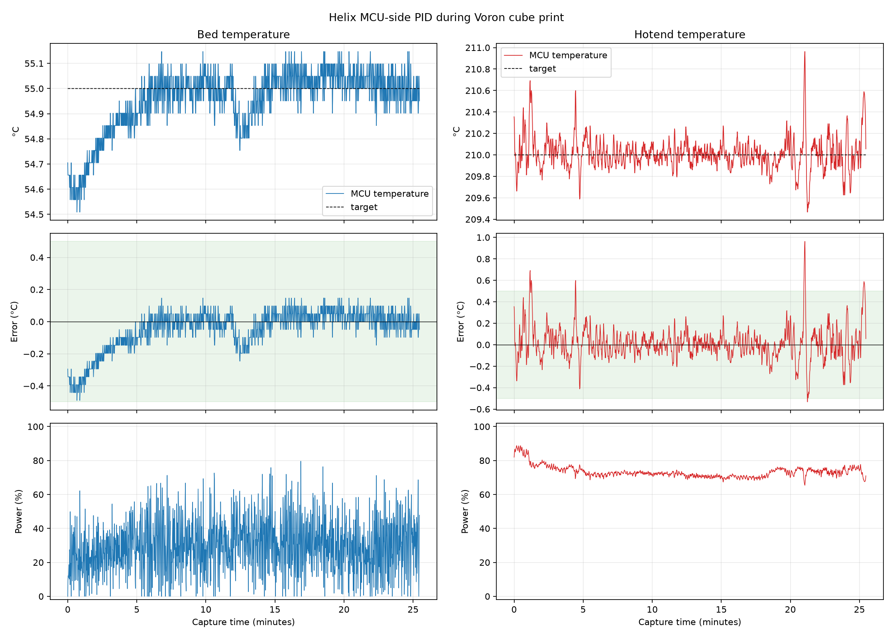

# Predictive Thermal Control

## Purpose

`control: helix_mpc` is a general MCU-autonomous heater controller for thermal
plants whose useful dynamics are slow relative to ADC acquisition. It was
introduced after a real PLA print showed an important distinction:

* the bed temperature was already tightly regulated (0.0717 C settled standard
  deviation and every settled observation within 0.25 C); but
* bed duty varied by about 15.9 percentage points at one standard deviation.

Retuning one Voron bed would not solve the architectural problem. A derivative
term necessarily converts small, quantized temperature changes into output
changes. More filtering can hide that response, but it does not express the
actual control objective: regulate temperature while explicitly minimizing
unnecessary actuator movement.

The complete baseline is retained as
[raw CSV](evidence/heater_control/pla-print-pid-baseline-20260720.csv),
[summary metrics](evidence/heater_control/pla-print-pid-baseline-20260720.json),
and the plot below. The values above use the settled window after the first
five minutes; the linked summary also reports the deliberately more
conservative whole-print window.



Helix therefore retains `helix_pid` as the compatibility and comparison
controller and adds a separate predictive algorithm. Neither controller is a
safety mechanism; both run beneath the same independent MCU limits, sensor
deadline, heating-progress verification, host-loss bound, and shutdown rules.

## Plant model

The first implementation uses a first-order thermal model:

```text
T(t + H) = Tambient + a * (T(t) - Tambient) + b * u

a = exp(-H / tau)
b = K * (1 - exp(-max(dt, H - L) / tau))
```

`K` is the steady temperature rise at full duty, `tau` is the dominant thermal
time constant, `L` is the fitted dead time, and `H` is the prediction horizon.
The retained free response uses `H`, while the input response uses `H-L`.

The host performs floating point conversion and model fitting. It uploads only
bounded coefficients. The MCU performs deterministic fixed-point arithmetic
and never fits a model or solves a matrix online.

An ambient value may come from a configured temperature object. Otherwise the
host uses the most recent idle observation of the heater itself, then the
explicit fallback. Once uploaded, that value remains usable during host loss.

## Closed-form constrained control

At each local ADC publication, the controller chooses constant horizon duty by
minimizing predicted temperature error and duty movement:

```text
J(u) = (Ttarget - Tpredicted(u))^2
       + rho^2 * (u - uprevious)^2

u_model = (b * (Ttarget - Tfree) + rho^2 * uprevious)
          / (b^2 + rho^2)
```

This is a real scalar model-predictive controller: it predicts a plant state,
optimizes a declared objective, and applies only the first bounded action before
recomputing from the next measurement. Because the plant has one input and the
objective is quadratic, the optimum has a closed form. A general online QP
solver would add complexity without improving this control problem.

Three supporting mechanisms make the model robust:

1. An MCU-local observer filters the temperature used for control. Raw ADC
   values still feed safety checks without this delay.
2. A slow signed integral bias learns unmodelled heat loss and ambient error.
   Directional anti-windup respects both the hard output range and slew bound.
3. An independent output slew limit bounds every duty transition even if a
   model or target changes. Model updates rebase the bias around the current
   output for a bumpless transition.

There is no derivative of a quantized sample. The movement penalty directly
states how much temperature correction is worth a change in duty.

The current MCU thermistor representation is a target-local tangent, not a
global nonlinear conversion. Prediction is therefore restricted to the
configured `thermal_control_band` around the target. Outside that band the MCU
uses slew-bounded full/off approach control, clears the observer, and enters
the model bumplessly only after the local conversion is valid. Safety always
uses raw ADC thresholds.

## Characterization and scheduling

The guarded command below performs an off-state drift preflight followed by a
constant-power step:

```text
HELIX_THERMAL_MODEL_CALIBRATE HEATER=heater_bed \
  TARGET=60 POWER=0.5 DURATION=900 CEILING=80 CONFIRM=YES
```

The physical output remains owned by the MCU. Its temperature ceiling, ADC
range, sample deadline, maximum power, heating-progress verification, and
host-loss behavior remain active. The host rejects a run when:

* fewer than 30 finite samples were captured;
* the observation is shorter than 10 seconds;
* off-state drift exceeds the configured limit;
* heating produces less than a 2 C rise;
* the best time constant is pinned to the fit search boundary; or
* a first-order response explains less than 95 percent of measured variance.

Accepted fits are stored as candidates, never activated automatically:

```text
HELIX_THERMAL_MODEL_STATUS HEATER=heater_bed
HELIX_THERMAL_MODEL_VALIDATE HEATER=heater_bed ID=<id> STATUS=VALIDATED CONFIRM=YES
HELIX_THERMAL_MODEL_COEFFICIENTS HEATER=heater_bed
HELIX_THERMAL_MODEL_CLEAR HEATER=heater_bed CONFIRM=YES
```

Validated models may be interpolated between measured target temperatures.
Extrapolation is forbidden. Gain and time constant are bounded relative to the
explicit `printer.cfg` model, and dead time has an independent absolute bound,
before upload. A malformed store, rejected run, out-of-range target, time
constant faster than the control period, or dead time beyond the configured
prediction horizon falls back to the explicit model.

## Generality

The algorithm does not contain bed-specific constants. The same controller and
fixed-point code cover a high-inertia bed and a low-inertia hotend; only the
identified plant and policy parameters differ. Optional local disturbance
inputs—part-cooling fan duty and extrusion heat flow—are a future model
extension, not a prerequisite for autonomous operation.

Workstation simulation currently qualifies representative plants with:

| Plant | Gain | Time constant | Dead time | Target |
|---|---:|---:|---:|---:|
| Bed | 90 C/duty | 300 s | 2.0 s | 55 C |
| Hotend | 280 C/duty | 20 s | 0.6 s | 210 C |

Both simulations include 0.05 C quantization. The hotend case also includes a
sustained load disturbance. After five time constants, both remain below
0.15 C mean error, 0.20 C standard deviation, 0.60 C peak error, and 0.02 RMS
duty change per controller update. These are deterministic regression gates,
not substitutes for physical qualification.

## Physical qualification gates

The predictive controller is not the preferred production controller until a
paired physical experiment passes all of the following:

1. Identical target, ambient, fan, material-flow, and measurement conditions
   for `helix_pid` and `helix_mpc`.
2. Temperature RMS and peak error no worse than PID.
3. At least 50 percent reduction in RMS duty change or a clearly explained
   physical limit.
4. No unacceptable increase in heat-up time, overshoot, or step-down recovery.
5. No output saturation during the intended operating envelope.
6. Host-loss continuation, stale-sample cutoff, maximum-temperature cutoff,
   and firmware restart behave identically to the qualified PID safety path.

The goal is not to declare model-based control superior by construction. The
goal is to make the objective measurable and retain the new algorithm only if
the installed hardware confirms the expected advantage.
