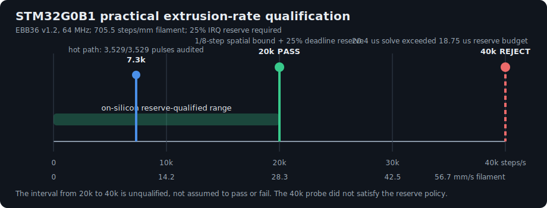
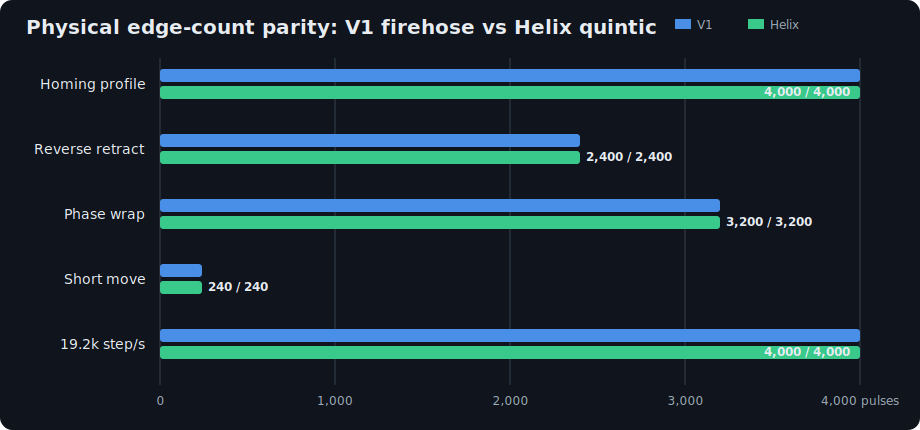
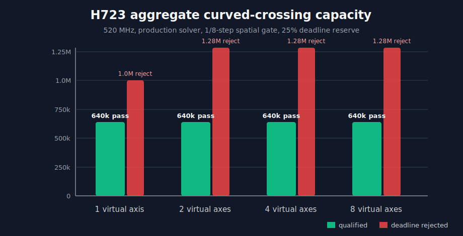

# STM32G0B1 HELIX motion qualification

## Why spending MCU cycles is the point

Klipper V1 and HELIX make opposite resource trades.

Klipper V1 solves motion on the host, compresses the resulting step times, and
sends a deadline-sensitive stream that grows with the number of physical
edges. The MCU is intentionally simple: it expands that stream and toggles
GPIO. This is excellent use of very small MCUs, but the host-to-board link is
part of the real-time step-generation loop.

HELIX sends a much smaller stream of time-bounded polynomial intentions. The
MCU integrates each intention, solves every half-step crossing against its own
clock, toggles GPIO, and records what it executed. The board therefore works
harder, by design. In return, link traffic scales with changes in the motion
curve rather than with microstep count, and the board owns enough state to
hold, stop on a local interrupt, report its position, and reconcile execution
after a link interruption.

```text
Klipper V1
G-code -> host planner -> host crossing solver -> step compression
       -> [one deadline stream proportional to physical edges] -> MCU GPIO

HELIX
G-code -> host planner -> bounded quintic fitter
       -> [short coefficient stream proportional to curve segments]
       -> MCU crossing solver -> MCU GPIO + execution log
```

The right acceptance criterion is consequently not “does HELIX leave the MCU
idle?” It is:

> Can the least powerful intended board compute the same physically required
> edge stream as V1, within a deterministic interrupt budget, while delivering
> the autonomy and observability that motivated onboard computation?

For the current V0 toolhead, that least-powerful target is the EBB36 v1.2's
64 MHz STM32G0B1. This document records the 2026-07-14 qualification of that
target.

## Result in one paragraph

The STM32G0B1 passes the practical EBB36 extrusion requirement. A production
solver regression time-compresses a captured quintic through 1x, 2x, 4x, 8x,
and 16x rates while preserving its geometry. The 16x case is approximately
20,000 physical extruder steps/s and must keep every solve within a 1/8-step
spatial bound and below 75% of the following pulse interval. It passes on the
real board. At the V0's approximately 705.5 steps/mm gearing, that is 28.3 mm/s
of 1.75 mm filament, or a kinematic 68.2 mm3/s. That is a solver capacity
conversion, not a claim that the installed hotend can melt 68.2 mm3/s. A 32x,
approximately 40,000-step/s probe was rejected because its 1,304-tick
(20.4 us) solve exceeded the 18.75 us solve deadline needed to preserve a
6.25 us / 25% reserve. The interval between 20k and 40k remains unqualified.



This establishes practical parity, not an unlimited raw-rate claim. V1's
precomputed stream can retain a higher synthetic edge ceiling because the MCU
does less work per edge. HELIX deliberately exchanges some of that unused
ceiling for local motion authority. The current evidence says that exchange is
sound for the EBB36's physical role; it does not say every conceivable
microstep rate is already supported.

## What executes on the STM32G0B1

Each active quintic carries fixed-point velocity, acceleration, jerk, snap,
and crackle. The firmware maintains a drift-free Q32.32 position accumulator
and solves the time at which the curve crosses the next half-step boundary.
The deadline path is specialized for a division-poor Cortex-M0+:

- pre-scaled Horner coefficients keep common intermediates in signed 32-bit
  range;
- four multiply-shift stages evaluate the quintic position;
- pure cruise uses a quotient/remainder recurrence rather than Newton;
- recurring curved motion predicts the next crossing from the previous
  interval and refines only until the spatial error is at most 1/8 step;
- the first two edges of a zero-speed start use full convergence, after which
  the recurring interval fast path takes over;
- an explicit 25% timer reserve protects other precision clients rather than
  treating “finished one tick before the pulse” as success.

This is substantial MCU work, but it is bounded work performed exactly where
the timing authority lives. Temperature sampling, communications, software
TMC UART, and other timer clients remain reasons for the reserve; the solver
is not allowed to consume the whole interrupt interval merely because a test
move still appears to work.

## Experiment 1: V1 edge-stream equivalence

`test/trajectory_v1_pulse_compare.py` sends the same trap queue through two
independent paths:

1. Klipper's original `itersolve -> stepcompress` pipeline, expanded back into
   the edge stream an MCU receives; and
2. quintic `segfit` followed by the exact production crossing solver compiled
   from `src/trajq.c` and `src/traj_stepper.c`.

The test compares every edge count and direction, not just the final position.
It includes acceleration from rest, reverse extrusion, a signed phase wrap, a
short move, and an EBB-like 19.2k-step/s profile.



| Case | V1 edges | HELIX edges | Mean time difference | Maximum time difference |
|---|---:|---:|---:|---:|
| Quintic homing profile | 4,000 | 4,000 | 25.08 us | 511.50 us |
| Quintic reverse retract | 2,400 | 2,400 | 30.04 us | 511.50 us |
| Quintic phase wrap | 3,200 | 3,200 | 22.52 us | 511.50 us |
| Quintic short move | 240 | 240 | 53.91 us | 511.50 us |
| Quintic EBB-like fast profile | 4,000 | 4,000 | 23.98 us | 266.33 us |

The large maximum time differences occur near zero velocity, where a bounded
spatial fitting error maps to a comparatively large time difference. They are
not missing or extra edges. Across the fidelity corpus, fitted quintics remain
inside the configured half-microstep motion tolerance and exact coefficient
chaining has zero accumulated fixed-point drift.

This corpus found a real defect during qualification: a quintic beginning at
exactly zero velocity used the queue-idle polling horizon as its first
crossing estimate. On a short acceleration segment that deferred early edges
to the segment boundary and created catch-up pulses. The final solver seeds
inside the segment, fully converges the first two crossings, and then switches
to the recurring predictor. The corpus would fail with 4,001 HELIX edges
against 4,000 V1 edges before the fix; all five cases above now match.

## Experiment 2: on-silicon deadline scaling

`traj_stepper_test_quintic_deadline()` runs inside `HELIX_SELF_TEST`, so it
measures the production firmware on the target rather than a workstation
simulation. It contains two gates:

- a zero-velocity acceleration vector verifies the two cold crossings before
  a recurring interval exists; and
- a captured EBB36 hot-extrusion quintic is time-compressed while its nth
  derivative is multiplied by the nth power of the rate scale. Geometry and
  pulse count remain the same while the available time between edges shrinks.

| Geometric scale | Approximate edge rate | Spatial gate | Deadline gate | Result |
|---:|---:|---|---|---|
| 1x | 1.25k steps/s | <= 1/8 step | solve < 75% of interval | Pass |
| 2x | 2.5k steps/s | <= 1/8 step | solve < 75% of interval | Pass |
| 4x | 5k steps/s | <= 1/8 step | solve < 75% of interval | Pass |
| 8x | 10k steps/s | <= 1/8 step | solve < 75% of interval | Pass |
| 16x | about 20k steps/s | <= 1/8 step | solve < 75% of interval | **Pass** |
| 32x probe | about 40k steps/s | crossing remained bounded | 20.4 us > 18.75 us solve deadline | **Rejected** |

The committed automatic pass gate remains 16x. The computation-only
`run_captured_quintic_probe` diagnostic makes both 16x and 32x directly
reproducible on the target; 32x is deliberately reported as `DEADLINE`, not
folded into the automatic self-test failure. Negative evidence defines the
safe engineering boundary and must not be silently converted into a pass by
weakening the reserve.

After the final firmware was flashed, both connected boards passed all five
live self-tests:

| Board | Motion clock | Firmware build | Link RTT | `traj_kernel` |
|---|---:|---|---:|---|
| EBB36 v1.2 / STM32G0B1 | 64 MHz | `a71fad74-dirty-20260714_145655-linuxathena` | 0.26 ms | Pass |
| BTT SKR Pico / RP2040 | 12 MHz scheduler, 200 MHz core | `a71fad74-dirty-20260714_145907-linuxathena` | 0.18 ms | Pass |

The `-dirty` suffix records that this qualification preceded the checkpoint
commit. The source content is the content committed with this document.

## Experiment 3: hot ABS extrusion through the full path

The physical test used the V0 at X=60, Y=60, Z=100, ABS at 260 C, and the bed
off. The extruder was never retracted more than 2 mm.

| Commanded operation | Result |
|---|---|
| +10 mm at 2 mm/s | Completed; reported E=10; printer remained ready |
| +5 mm at 10 mm/s | Completed; reported E=15; printer remained ready |
| -2 mm / +2 mm at 5 mm/s | Completed; returned to E=15; no heatbreak-risking retract |

The 10 mm/s run is about 7.1k physical steps/s with the active BMG gearing. It
proves the real EBB36 step/dir output, TMC driver, hotend, filament load, host
planner, quintic fitter, mixed-clock transport, and onboard solver together.
It is intentionally below the synthetic 20k gate because melt capacity, not
the crossing solver, should limit a hot extrusion test.

## Experiment 4: intention-to-execution reconciliation

The +5 mm / 10 mm/s hot path was isolated to telemetry lines 77268 through
77297 and
audited in the EBB36's local 64 MHz execution-clock domain:

```text
extruder oid=5 segments=8 holds=1 pulses=3529 min_interval_ticks=8762
extruder oid=5 executed_pulses=3529 min_executed_interval_ticks=8762
execution_records=9 matched_boundaries=8 triggers=0 errors=0
```

The intended and executed replay therefore agree on all 3,529 physical edges
and on the 8,762-tick minimum interval (136.9 us, about 7.3k steps/s). No
underrun, endpoint mismatch, clock discontinuity, accumulator discontinuity,
trigger mismatch, or execution fault was present.

This experiment also found an observability bug: persisted intention duration
and clocks were in the Pico's 12 MHz machine-time domain, while the quintic
coefficients and MCU execution log were in the EBB36's 64 MHz local domain.
The motion itself was correct, but the first audit replay used the wrong
duration and could not match execution clocks. Telemetry now records both
machine and execution clock fields, and the auditor can infer the local clock
anchor from a rebase for older captures. A bounded `--before-line` option
prevents a complete path from being confused with older records that have
rolled out of the MCU's finite flight-recorder ring.

## Experiment 5: STM32H723 compute-headroom comparison

An FK723M1-ZGT6 development board (STM32H723ZGT6) was flashed directly through
the STM32 ROM DFU interface with the computation-only configuration in
`test/helix-configs/stm32h723-fk723m1.config`. The board's 15 MHz HSE is not a
selectable Klipper H7 reference, so this qualification deliberately uses the
supported internal HSI path and Klipper's conservative 520 MHz H723 clock. It
does not overclock the part and does not depend on an ST-Link.

The board served its dictionary over USB and passed all five built-in tests:
CRC wire vector, monotonic timer, timer-rate fingerprint, RAM pattern, and the
trajectory kernel. The `traj_kernel` result remained the expected value 4.

For capacity measurement, `run_traj_benchmark` creates one to eight independent
solver states without allocating an oid or configuring GPIO. Each state runs
an accelerating segment with a roughly 48-edge duration through the production
quintic execution path.
At the practical H7 rates used below velocity, acceleration, jerk, snap, and
crackle are all non-zero. Two cold edges are warmed exactly as the live backend
does; 32 recurring crossings are then timed. A result passes only when:

- every reconstructed crossing stays within 1/8 physical step;
- the combined solve time for all virtual axes remains below 75% of the
  shortest following pulse interval; and
- all states reach the expected next boundary monotonically.



| Virtual axes | Per-axis rate | Aggregate crossings | Worst solve | Shortest interval | Reserve | Result |
|---:|---:|---:|---:|---:|---:|---|
| 1 | 640k/s | 640k/s | 550 ticks / 1.06 us | 767 ticks / 1.48 us | 28.3% | **Pass** |
| 2 | 320k/s | 640k/s | 993 ticks / 1.91 us | 1,533 ticks / 2.95 us | 35.2% | **Pass** |
| 4 | 160k/s | 640k/s | 1,881 ticks / 3.62 us | 3,067 ticks / 5.90 us | 38.7% | **Pass** |
| 8 | 80k/s | 640k/s | 3,657 ticks / 7.03 us | 6,135 ticks / 11.80 us | 40.4% | **Pass** |
| 1 | 1M/s | 1M/s | 544 ticks / 1.05 us | 519 ticks / 1.00 us | negative | Rejected |
| 2 | 640k/s | 1.28M/s | 988 ticks / 1.90 us | 811 ticks / 1.56 us | negative | Rejected |
| 4 | 320k/s | 1.28M/s | 1,876 ticks / 3.61 us | 1,621 ticks / 3.12 us | negative | Rejected |
| 8 | 160k/s | 1.28M/s | 3,652 ticks / 7.02 us | 3,241 ticks / 6.23 us | negative | Rejected |

The qualified statement is therefore **at least 640,000 aggregate recurring
curved crossings/s with the 25% reserve intact**, not an interpolated maximum.
The worst passing spatial error was only 0.0113 of the allowed 1/8-step error.
The near-constant aggregate pass point is strong evidence that crossing solve
cost, rather than an axis-specific queue artifact, dominates this synthetic
load.

This result supports an H7-first board design. It supplies roughly an order of
magnitude more qualified aggregate curve-synthesis capacity than the present
G0B1 toolhead requirement while retaining the simple MCU toolchain, interrupt
model, and firmware architecture already in use. An FPGA can still be valuable
for exceptionally high channel counts, deterministic waveform fabrics, or
specialized encoders, but the evidence does not justify making one mandatory
for the next HELIX controller.

### Admission-control implication

Firmware should cap configured trajectory objects for memory safety, but a
fixed “maximum axes” number is not the right compute-safety rule. Solver demand
scales primarily with the aggregate physical crossing rate and polynomial
path: eight 80k-step/s axes and one 640k-step/s axis consumed approximately the
same H723 budget in this experiment.

A production fleet profile should therefore advertise a qualified aggregate
curved-crossing budget. At configuration time the host can conservatively sum
each actuator's worst-case `max_velocity / step_distance`, apply a cost factor
for its enabled polynomial backend, and reject a group whose simultaneous
demand exceeds the board's budget after reserve. A separate hard oid count can
remain as a RAM/queue bound. Runtime missed-deadline and queue telemetry remain
the final fail-safe; static admission is intended to prevent reaching them,
not replace them.

## Why this is preferable to the firehose for this board

The V1 firehose is cheaper per edge on the MCU. HELIX is better only if the
additional work buys capabilities and remains inside a proven budget. On the
EBB36 it now does:

| Property | V1 firehose | HELIX intention execution |
|---|---|---|
| Link traffic scales with | compressed physical edges | polynomial segments |
| Nonlinear crossing solve lives on | host | MCU |
| Board knows polynomial position | no | yes, Q32.32 accumulator |
| Stop source can act locally | only against queued pulse playback | yes, against the active intention |
| Link-loss response | exhaust queue, then shutdown | bounded hold/recovery policy |
| Execution evidence | host knows what it sent | MCU flight log records what ran |
| Non-stepper backend | separate host semantics | same intention queue can drive PWM/DAC/FOC |
| Tested EBB practical envelope | established Klipper behavior | about 20k steps/s with reserve |
| Raw synthetic ceiling | expected higher | 40k reserve gate not passed |

The architectural advantage is therefore not “more steps because the MCU does
math.” It is “enough steps for the physical actuator, with local authority and
less real-time dependence on the link.” If a future EBB configuration truly
requires more than the qualified range, the correct response is to optimize
and re-qualify the solver, reduce unnecessary microstepping, or select a more
capable toolhead MCU—not to hide the failed reserve test.

## Reproduction

Host fidelity and pulse comparison:

```shell
~/klippy-env/bin/python test/trajectory_v1_pulse_compare.py
~/klippy-env/bin/python test/segfit_fidelity_test.py
~/klippy-env/bin/python test/extruder_trajectory_test.py
```

Focused audit of the captured hot path:

```shell
~/klippy-env/bin/python scripts/helix_motion_audit.py \
  ~/printer_data/logs/atlas-telemetry.jsonl \
  --session dff352c4ec78476ab3edb7a577ff1fa8 \
  --actuator extruder --after-line 77267 --before-line 77298
```

Live on-board gate after flashing a `WANT_SELF_TEST` build:

```text
HELIX_SELF_TEST MCU=ebb36
```

Computation-only rate sweep on a self-test firmware image:

```shell
~/klippy-env/bin/python scripts/helix_traj_benchmark.py \
  --device /dev/serial/by-id/usb-Klipper_stm32h723xx_...-if00 \
  --rates 20000,40000,80000,160000,320000,640000,1000000 \
  --axes 1,2,4,8
```

`max_error_eighths` is expressed as a fraction of the allowed 1/8-step error;
values below 1 satisfy the spatial gate. A non-zero script exit is expected
when a sweep intentionally includes rejected capacity probes.

Reproduce the captured EBB curve's committed 16x pass and 32x rejection:

```shell
~/klippy-env/bin/python scripts/helix_traj_benchmark.py \
  --device /dev/serial/by-id/usb-Klipper_stm32g0b1xx_...-if00 \
  --captured-scales 16,32
```

The diagnostic reports the measured maximum solve ticks, shortest crossing
interval, spatial error, and reserve for each scale. Its exit status is
non-zero when the requested set intentionally includes the rejected 32x case.

## Remaining qualification

- Run a real sliced print with sustained coordinated XY, Z, and extrusion;
  the current evidence qualifies the motion pieces and hot extruder, not a
  complete part.
- Repeat the toolhead qualification over CAN for the V2.4. USB success proves
  the protocol and solver but not CAN physical-layer behavior.
- Measure GPIO edges with a logic analyzer if an external timing reference is
  required; the present proof uses V1 comparison, fixed-point replay, and the
  MCU's own timer/flight log.
- Do not claim 40k steps/s until the 25% reserve gate passes on silicon.

These limitations are compatible with the conclusion: the STM32G0B1 is not
too small for HELIX's EBB36 role. It is being used much more thoroughly than a
V1 playback MCU, and the qualification demonstrates that the additional work
fits the practical extrusion envelope with deterministic margin.
